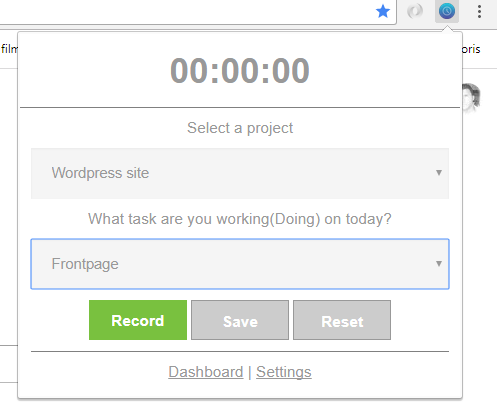
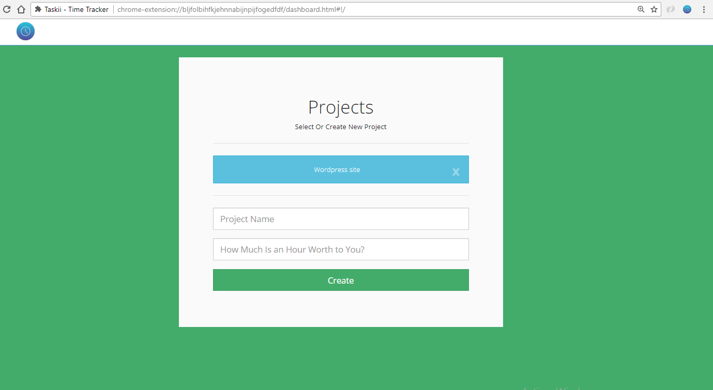
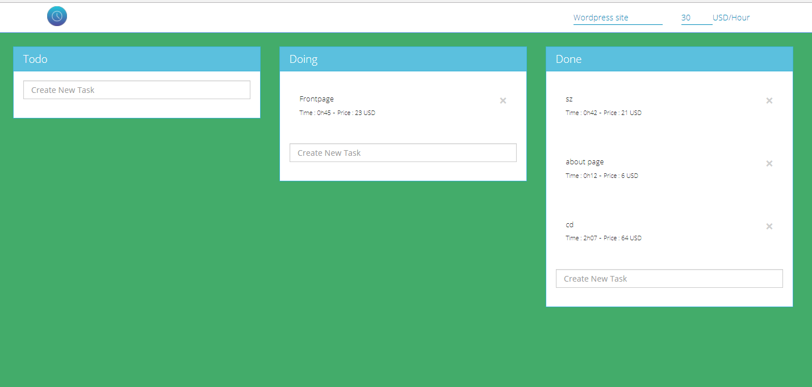
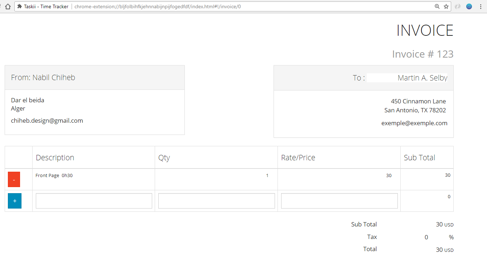

  

Taskii Chrome Extension
==
Offline Project & Tasks Manager allow freelancers to :

- Track their time 
- Organize tasks in a kanban board 
- Create invoices .

Built with `AngularJS`  ,`ngDraggble` 

It uses the browser's `localStorage` & `chrome sync storage`  to save data

Demo
====
https://chihebnabil.github.io/AngularJS-Kanban-Applicaton/

